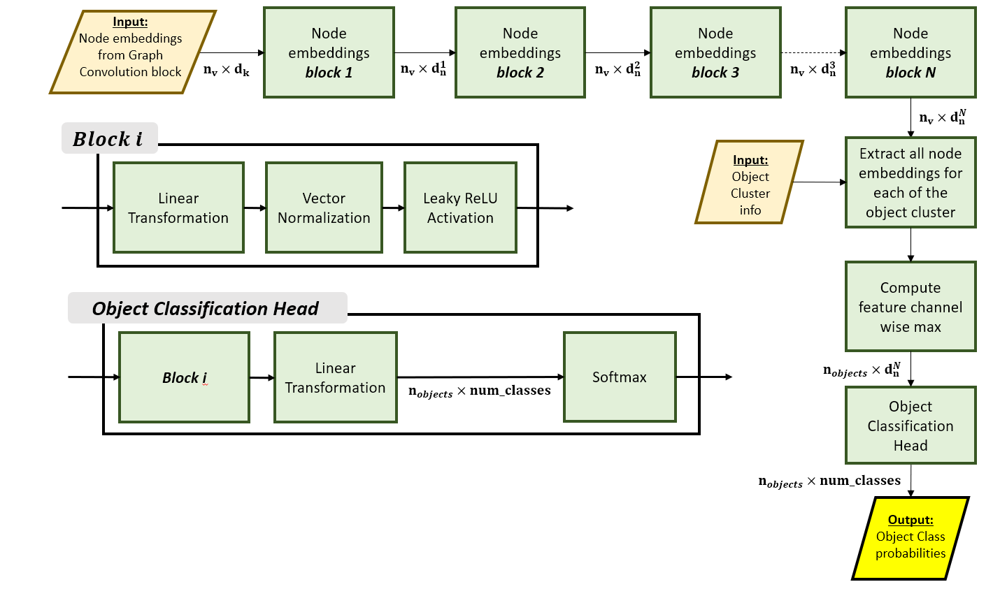

# Multi-task Learning using Message Passing Graph Neural Network for Radar based Perception Functions

[](https://github.com/UditBhaskar19/ANCHOR_FREE_OBJECT_DETECTOR_FOR_CAMERA/blob/main/LICENSE) 
[](https://pytorch.org/get-started/locally/) 
[](https://www.python.org/downloads/)

<br>

[Code](AnchorFree2DObjectDetection) <br>
[Project Documents](AnchorFree2DObjectDetection/doc) <br>
[Output Videos](AnchorFree2DObjectDetection/video_inference) <br>

## Introduction
Radar is emerging as an important sensor for AD/ADAS perception functions. Due to **occlusion penerating ability**, resilience to adverse weather conditions and non-dependence on an extternal light source, radars are often considered as among the primary sensors for vehicle autonomy. In recent years due to improvement in automotive radar technology in terms of both hardware and dsp pipeline, Synthetic Aperture Radar (SAR) in small form factor has become commercially available, which can be mounted on vehicles like cars, trucks, construction vehicles etc. Such radars have a high measurement resolution which is beneficial for deep learning based techniques to improve components in radar perception pipelines like clusterijng, tracking and prediction.
<br><br>
One of the important step in radar based object tracking for perception functions is the initialization of track hypothyesis. Such track hypothesis is usually generated by clustering the radar measurements using some clustering techniques like DBSCAN, and assigning a new track id to each of the unassociated clusters. The density of the point cloud is heterogeneous within the radar FOV as it depends on various factors like the object type, object shape, location of the object w.r.t the sensor, scene geometry and varous intrinsic properties of the sensor. Clusterring algorithims like DBSCAN with constant threshold parameter performs poorely especially in cluttered scenes.
<br><br>
Hence in this project a deep-learning based radar point cloud transformation is proposed so that DBSCAN like clustering technique with a const5ant threshold parameter can be used for clustering and identifying objects. Additionally various other tasks are performed which includes: link prediction, node segmentation, object classification.
<br>
In summary given as input the radar measurements. We perform the following task using deep learning:
   - Measurement offset prediction for clustering
   - Link prediction for clustering
   - Measurement classification / Node segmentation
   - Object classification

<br>

<div align="center">


*GNN Inputs and Outputs.*

<br>


*Model Architecture.*

<br>


*Predictions.*

<br>

</div>

<br>


<details>
<summary>

## Table of Contents <a name="t0"></a>

</summary>

<ul>

<li><a href="#About-The-Project">About The Project</a></li>
   <ol>
      <li><a href="#Requirements">Requirements</a></li>
      <li><a href="#How-to-run-the-project">How to run the project</a></li>
      <li><a href="#Project-Folder-Structure">Project Folder Structure</a></li>
   </ol>
</li>
<li><a href="#Model-Architecture">Model Architecture</a> 
   <ol>
       <li><a href="#Concept-Level-Architecture">Concept Level Architecture</a></li> 
       <li><a href="#Node-and-Edge-Embedding">Node and Edge Embedding</a></li> 
       <li><a href="#Graph-Convolution">Graph Convolution</a></li> 
       <li><a href="#Graph-Link-Prediction">Graph Link Prediction</a></li> 
       <li><a href="#Node-Offset-Prediction">Node Offset Prediction</a></li> 
       <li><a href="#Node-Segmentation">Node Segmentation</a></li> 
       <li><a href="#Object-Classification">Object Classification</a></li> 
   </ol> 
</li>
<li><a href="#Predicted-vs-GT-Clusters-Visualization">Predicted vs GT Clusters Visualization</a></li>
<li><a href="#Conclusion">Conclusion</a></li>
<li><a href="#Reference">Reference</a></li>

</ul>
</details>

<br>


## About The Project

### Requirements
```bash
imageio>=2.34.0
matplotlib>=3.7.2
numpy>=1.25.0
torch>=2.0.1
torchvision>=0.15.2
torch_geometric>=2.5.0
tqdm>=4.66.1
```

### How to run the project
```bash
git clone https://github.com/UditBhaskar19/GRAPH_NEURAL_NETWORK_FOR_AUTOMOTIVE_RADAR_PERCEPTION
cd GRAPH_NEURAL_NETWORK_FOR_AUTOMOTIVE_RADAR_PERCEPTION

# to change the configurations modify the following file
configuration_radarscenes_gnn.yml

# to test the model if it can overfit use the follwing notebook
script_overfit_gnn.ipynb

# to train the model use the following notebook
script_train_model_gnn.ipynb

# to save outputs as a sequence of images use the following notebook
save_predictions.ipynb

# to save the ground-truth vs prediction comparison results use the following notebook
save_predictions_and_gt.ipynb

# to create GIF use the following notebook
create_gif.ipynb
```

### Project Folder Structure
```bash
dataset           # radarscenes dataset folder 
model_weights     # Model weights folder
tensorboard       # data folder for loss visualization in tensorboard
modules
│───compute_features         # module to compute input graph features for GNN
│───compute_groundtruth      # Compute ground-truths for model training
│───data_generator           # dataset generator module
│───data_utils               # dataset utilities for reading and arranging the input data from files
│───inference                # model inference modules
│───neural_net               # neural net modules.
│───plot_utils               # plotting and visualization.
│───set_configurations       # create and set configuration class.
│───readme_artifacts         # readme files.
script_overfit_gnn.ipynb         # overfit on a very small dataset
script_train_model_gnn.ipynb     # train GNN model
script_train_model_gnn_continue_train.ipynb    # continue training
save_predictions.ipynb           # save predictions inside the folder 'results'
save_predictions_and_gt.ipynb    # save predictions and gt comparizon plots inside the folder 'results'
create_gif.ipynb                 # create a gif video from a sequence of saved images               
```
[TOC](#t0)

<br>


## Model Architecture

### Concept Level Architecture

<br>


<br>

### Node and Edge Embedding

<br>


<br>

### Graph Convolution

<br>


<br>

### Graph Link Prediction

<br>


<br>

### Node Offset Prediction

<br>


<br>

### Node Segmentation

<br>


<br>

### Object Classification

<br>



<br>


[TOC](#t0)

<br>


## Predicted vs GT Clusters Visualization


[TOC](#t0)

<br>

## Conclusion
<ul>
<li> Person class suffers from low recall due to much less number of training samples </li>
<li> The basic building block of the model is weight standardized conv2d followed by group norm and a non-linear activation. This helped in setting the batch size small (6 in this case) so that it fits in the gpu memory. It also helps in keeping the training stable (no NaNs). </li>
<li>There are ways to improve the performance. Some of them are: fine-tuning the backbone, utilizing several other open source datasets, taking a second stage to improve recall, training the model end to end for different tasks such as segmentation and tracking. These shall be part of future releases </li>
</ul>

<br>

[TOC](#t0)

<br>

## Reference
<ul>
   <li>

   [BDD100K: A Diverse Driving Dataset for Heterogeneous Multitask Learning](https://arxiv.org/pdf/1805.04687.pdf)</li>
   <li>
   
   [FCOS: A simple and strong anchor-free object detector](https://arxiv.org/pdf/2006.09214.pdf)</li>
   <li>
   
   [HybridNets: End-to-End Perception Network](https://arxiv.org/ftp/arxiv/papers/2203/2203.09035.pdf)</li>
   <li>
   https://www.cvlibs.net/datasets/kitti/</li>
</ul>

<br>

[TOC](#t0)


