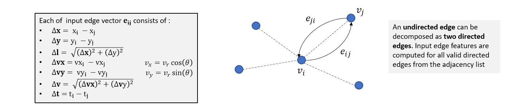
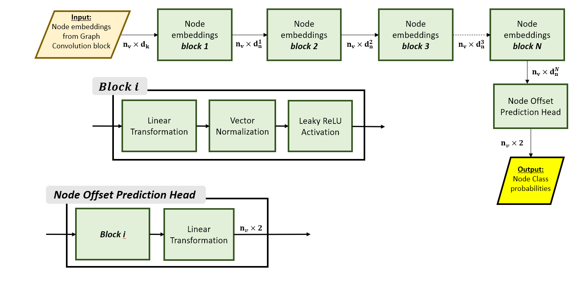

# Multi-task Learning using Message Passing Graph Neural Network for Radar based Perception Functions

[](https://github.com/UditBhaskar19/ANCHOR_FREE_OBJECT_DETECTOR_FOR_CAMERA/blob/main/LICENSE) 
[](https://pytorch.org/get-started/locally/) 
[](https://www.python.org/downloads/)

[Project Document](doc) <br>
[Output Videos](results) <br>

<div align="center">


*GNN Model Predictions.*

</div>

<br>


## Introduction
Radar is increasingly recognized as a crucial sensor for Advanced Driver Assistance Systems (ADAS) and autonomous driving (AD) perception tasks. Its ability to **penetrate occlusions**, **withstand adverse weather conditions**, and **operate independently of external lighting sources** positions it as one of the primary sensors for vehicle autonomy. Advancements in automotive radar technology, encompassing both hardware and digital signal processing (DSP) pipelines, have led to the availability of Synthetic Aperture Radar (SAR) in compact form factors suitable for installation on various vehicle types, including cars, trucks, buses and construction vehicles. Such radars have a high measurement resolution which is beneficial for deep learning based techniques to improve components in radar perception pipelines like measurement clustering, object tracking and track prediction.
<br><br>
One of the critical step in radar based object tracking for perception functions is the initialization of track hypothyesis. Typically, track hypotheses are established by clustering radar measurements using techniques such as DBSCAN, followed by assigning a unique track ID to each unassociated cluster. The density of the point cloud varies within the radar FOV as it depends on various factors like the object type, object shape, location of the object from the sensor, scene geometry and varous internal properties of the sensor. Traditional clustering algorithms like DBSCAN, employing constant threshold parameters, exhibit suboptimal performance, especially in cluttered scenes.
<br><br>
Thus, this project proposes a deep-learning-based transformation of radar point cloud to enable the use of DBSCAN-like clustering techniques with constant threshold parameters for object identification. Additionally, various other tasks are addressed, including link prediction, node segmentation, and object classification.
<br><br>
In summary, **given as input the radar measurements**. The **following task are performed** using deep learning:
   - **Measurement offset prediction for clustering**
   - **Link prediction for clustering**
   - **Measurement classification / Node segmentation**
   - **Object classification**

<br>

<div align="center">


*GNN Inputs and Outputs.*

<br>


*Model Architecture.*

<br>


*Tensorboard Plots.*

<br>


*Normalized Confusion Matrix.*

<br>

</div>


<details>
<summary>

## Table of Contents <a name="t0"></a>

</summary>

<ul>

<li><a href="#About-The-Project">About The Project</a></li>
   <ol>
      <li><a href="#Requirements">Requirements</a></li>
      <li><a href="#How-to-run-the-project">How to run the project</a></li>
      <li><a href="#Project-Folder-Structure">Project Folder Structure</a></li>
   </ol>
</li>
<li><a href="#Dataset-and-Sensor-Setup">Dataset and Sensor Setup</a></li>
<li><a href="#Data-Preprocessing">Data Preprocessing</a></li>
<li><a href="#Model-Architecture">Model Architecture</a> 
   <ol>
       <li><a href="#Why-Graph-Neural-Network">Why Graph Neural Network</a></li>
       <li><a href="#Concept-Level-Architecture">Concept Level Architecture</a></li>
       <li><a href="#Model-Inputs">Model Inputs</a></li> 
       <li><a href="#Detailed-Architecture">Detailed Architecture</a></li>
       <ol>
            <li><a href="#Node-and-Edge-Embedding">Node and Edge Embedding</a></li> 
            <li><a href="#Graph-Convolution">Graph Convolution</a></li> 
            <li><a href="#Graph-Link-Prediction">Graph Link Prediction</a></li> 
            <li><a href="#Node-Offset-Prediction">Node Offset Prediction</a></li> 
            <li><a href="#Node-Segmentation">Node Segmentation</a></li> 
            <li><a href="#Object-Classification">Object Classification</a></li>
      </ol> 
   </ol> 
</li>
<li><a href="#Model-Output-Postprocessing">Model Output Postprocessing</a>
<li><a href="#Predicted-vs-GT-Clusters-Visualization">Predicted vs GT Clusters Visualization</a></li>
<li><a href="#References">References</a></li>

</ul>
</details>

<br>


## About The Project

### Requirements
```bash
imageio>=2.34.0
matplotlib>=3.7.2
numpy>=1.25.0
torch>=2.0.1
torchvision>=0.15.2
torch_geometric>=2.5.0
tqdm>=4.66.1
```

### How to run the project
```bash
git clone https://github.com/UditBhaskar19/GRAPH_NEURAL_NETWORK_FOR_AUTOMOTIVE_RADAR_PERCEPTION
cd GRAPH_NEURAL_NETWORK_FOR_AUTOMOTIVE_RADAR_PERCEPTION

# to change the configurations modify the following file
configuration_radarscenes_gnn.yml

# to test the model if it can overfit use the follwing notebook
script_overfit_gnn.ipynb

# to train the model use the following notebook
script_train_model_gnn.ipynb

# to save outputs as a sequence of images use the following notebook
save_predictions.ipynb

# to save the ground-truth vs prediction comparison results use the following notebook
save_predictions_and_gt.ipynb

# to create GIF use the following notebook
create_gif.ipynb
```

### Project Folder Structure
```bash
doc               # project documents
dataset           # radarscenes dataset folder 
model_weights     # Model weights folder
tensorboard       # data folder for loss visualization in tensorboard
modules
│───compute_features         # module to compute input graph features for GNN
│───compute_groundtruth      # Compute ground-truths for model training
│───data_generator           # dataset generator module
│───data_utils               # dataset utilities for reading and arranging the input data from files
│───inference                # model inference modules
│───neural_net               # neural net modules.
│───plot_utils               # plotting and visualization.
│───set_configurations       # create and set configuration class.
│───readme_artifacts         # readme files.
script_overfit_gnn.ipynb         # overfit on a very small dataset
script_train_model_gnn.ipynb     # train GNN model
script_train_model_gnn_continue_train.ipynb    # continue training
save_predictions.ipynb           # save predictions inside the folder 'results'
save_predictions_and_gt.ipynb    # save predictions and gt comparizon plots inside the folder 'results'
create_gif.ipynb                 # create a gif video from a sequence of saved images               
```
[TOC](#t0)

<br>


## Dataset and Sensor Setup
[RadarScenes](https://radar-scenes.com/) dataset is used in this project 

<br>

<div align="center">


*Sensor Setup.*

<br>


*Radar Scan.*

</div>

[TOC](#t0)

<br>

## Data Preprocessing

<br>

<div align="center">


*Input Data Processing. For more details refer the [Project Document](doc)*

</div>

<br>

In this project, only dynamic measurements are considered as inputs to the model to reduce computational load. The pre-processing pipeline involves the following steps:

- **Temporal Sliding Window:**
A temporal sliding window of size 10 is employed, which corresponds to approximately 155 milliseconds. This sliding window technique is used to accumulate radar frames, providing a short-term history of the dynamic environment.

- **Transformation to Vehicle Frame:**
The accumulation process begins by transforming the radar measurements from the sensor frame to the vehicle frame. This step is crucial to ensure that all measurements are in a common reference frame.

- **Ego-Motion Compensation:**
To account for the motion of the ego-vehicle, ego-motion compensation is applied. This involves adjusting the radar measurements to correct for the vehicle's movement from the previous time step to the current time step. This compensation ensures that the dynamic measurements accurately reflect the positions of objects relative to the moving vehicle.

- **Region of Interest Filtering:**
Finally, the radar measurements are filtered to retain only those within a pre-defined region of interest (ROI) around the ego-vehicle. This region is defined as a 100-meter by 100-meter area centered on the vehicle. By focusing on this specific area, the computational load is further reduced while maintaining relevant data for model input.

<br>

**The detailed steps are as follows**

<br>

<div align="center">


*Procedure to identify dynamic measurements.*

<br>


*Coordinate transformation of measurements from sensor frame to vehicle frame.*

<br>


*Ego-motion compensation procedure.*

</div>

<br>


[TOC](#t0)

<br>


## Model Architecture

### Why Graph Neural Network

Radar point cloud data presents unique challenges for processing, primarily due to its sparse nature and the lack of an inherent order among the points. Traditional methods like voxelization into 2D or 3D grids, followed by Convolutional Neural Network (CNN) architectures, face significant limitations when applied to radar data:

- **Information Loss**: 
Voxelization can result in a significant loss of information. Given the already sparse nature of radar data, this loss can be detrimental to the accuracy and effectiveness of the data processing.
- **Ineffective Information Processing:**
Many voxels remain empty due to the sparsity of radar data. This leads to inefficient use of computational resources, as the CNN has to process a large number of empty voxels.
- **Memory Intensity:** 
CNN architectures are typically memory-intensive, which can be problematic with resourse constrained systems.

Given these challenges, there is a need for an architecture that can effectively process sparse radar data in a manner similar to how CNNs process image pixels. This is where Graph Neural Networks (GNNs) come into play which has the following advantages

- **Effective Handling of Sparsity:**
GNNs are well-suited for handling sparse data. Unlike voxelization, GNNs do not require the data to be mapped onto a dense grid. Instead, the radar point cloud is represented as a graph, where each point is a node, and edges connect neighboring nodes based on certain criteria, such as proximity.

- **Generalized Convolution Over Unordered Sets:**
In a GNN, each node can aggregate information from its neighboring nodes and edges. This process is akin to a generalized form of convolution that operates over unordered point sets. This allows for effective feature extraction and information propagation across the radar point cloud.

- **Permutation Invariant and Equivariant Operations:**
One of the key strengths of GNNs is their ability to perform permutation invariant and equivariant operations. This means that the output of the network is independent of the order of the input points. To achieve this, GNNs use operations such as:
      <ul>
         <li> **Permutation Invariant Operations:** Sum, average, and attention-weighted sum, which ensure that the aggregate information remains consistent regardless of the input order. </li>
         <li> **Permutation Equivariant Operations:** Shared Multi-Layer Perceptrons (MLPs) per input feature vector and self-attention blocks, which maintain the relational structure between input features. </li>
      </ul>

- **Efficient Information Processing:**
By utilizing graph-based representations and operations, GNNs can efficiently process the radar point cloud without the overhead of dealing with empty voxels or excessive memory usage. This leads to a more streamlined and effective processing pipeline.

In conclusion, Graph Neural Networks offer a robust and efficient approach to processing radar point cloud data. By leveraging the natural structure of graphs and utilizing permutation invariant and equivariant operations, GNNs overcome the limitations of traditional voxelization and CNN-based methods. This makes GNNs an ideal choice for handling the sparse and unordered nature of radar data, ensuring more accurate and computationally efficient processing

<br>

[TOC](#t0)

<br>

### Concept Level Architecture

<br>


The architecture can be summarized in terms of some key building blocks which are as follows:
- **Input Node and Edge Feature Embedding Blocks**
The initial stage of the architecture involves pre-processing the node and edge input features. This stage, which can be considered the **Network Base**, includes the following components:
      <ol>
         <li> **Node Embedding Block:** Embeds the input features associated with each node into a higher-dimensional space, capturing more complex feature representations. </li>
         <li> **Edge Embedding Block:** Similarly, this block embeds the input features of the edges. </li>
      </ol> <br>
The output from the edge embedding block is fed into each of the Graph Convolution Blocks, ensuring that edge features are utilized effectively during feature aggregation and update. This approach not only enhances the model's ability to leverage edge information but also facilitates efficient gradient flow during model training, contributing to more stable and effective learning.

- **Graph Convolution Layers**
In this stage, referred to as the **Network Neck**, information from adjacent nodes and edges is aggregated and updated iteratively. This process allows the receptive field to expand, enabling nodes to incorporate information from nodes that are multiple hops away. Specifically, the layers perform the following functions:
      <ol>
         <li> **Aggregation:** Gathers features from neighboring nodes and edges. </li>
         <li> **Update:** Integrates the aggregated features to update the node representations. </li>
      </ol> <br>
Through consecutive applications of these operations, nodes progressively gain information from their broader network context, enhancing the overall feature representations.

- **Task Specific Blocks**
The final stage of the architecture, known as the Network Head, is designed for post-processing the aggregated feature embeddings to make task-specific predictions. This block is tailored to the specific requirements of the task at hand, ensuring that the processed features are transformed into the desired output format. Key functions in this block include:
      <ol>
         <li> **Post-Processing:** Applies additional layers or operations to refine the features for the specific task. </li>
         <li> **Prediction:** Generates the final output based on the refined features, which could include classification scores, regression outputs, or other task-specific results. </li>
      </ol> <br>

[TOC](#t0)

<br>

### Model Inputs: 
Node features, Edge features and Adjacency Info is given as inputs to the model which is illustrated in the following figures.

<div align="center">


*Node Input Features.*

<br>



*Edge Input Features.*

<br>


*Adjacency Information Computation.*

<br>

</div>

The selection and computation of node and edge input features are crucial for the effectiveness of the model. The key factors considered for this process are as follows:
- **Translation Invariant Node Attributes:**
Only those node attributes that exhibit at least translation invariance are selected, such as radar cross-section (RCS), range-rate, and normalized time index. The normalized time index is included to uniquely distinguish between measurements accumulated at different time steps, potentially enhancing the model's performance across various tasks.

- **Measurement Accuracy Variability:**
The accuracy of radar measurements can vary with range and azimuth. To capture this variability, range and azimuth confidence values are included as input features.

- **Node Feature Augmentation:**
 It is often challenging for a Graph Neural Network (GNN) to learn features such as node degree. Therefore, these features are computed from the adjacency matrix and augmented to the input node feature vector to provide the model with additional structural information.

- **Edge Attributes for Interaction Representation:**
Edges typically represent interactions and relationships between connected nodes. The attributes chosen to represent these interactions include relative positional and velocity differences: dx, dy, dl (distance in length), dvx (difference in velocity in the x direction), dvy (difference in velocity in the y direction), dv (difference in velocity), and dt (difference in time).

<br>

[TOC](#t0)

<br>

### Detailed Architecture

<br>

### Node and Edge Embedding

Here the node and edge input features are preprocessed so that the input features associated with nodes and edges are transformed into a higher-dimensional space, capturing more complex feature representations

<br>


<br>

### Graph Convolution

This is a residual block. The model has a series of these blocks connected one after the other. The main purpose of this block is to increase the receptive field one hop by aggregating and updating neighbouring node and edge features.

<br>


<br>

### Graph Link Prediction

In this block first the adjacent matrix is transformed to an upper triangular matrix and then all the valid pairs of node embeddings are extracted, which are supsequently processed by a permutation invariant and equivariant functions to do link prediction.

<br>


<br>

### Node Offset Prediction

Each of the node embeddings are processed by a permutation invariant and equivariant functions to predict cluster center offsets.

<br>



<br>

### Node Segmentation

Each of the node embeddings are processed by a permutation invariant and equivariant functions to predict class of each nodes.

<br>


<br>

### Object Classification

This is framed as a sub-graph prediction problem. First an array of node index is extracted for each clusters. The node embeddings are extracted for each of the node index and subsequently processed by a permutation invariant and equivariant functions to predict object class.

<br>


<br>

[TOC](#t0)

<br>


## Model Output Postprocessing

Our end goal is to detect valid objects and predict their classes. An overview of different approaches are shown in the below figures.

**Approach 1**


<br>

**Approach 2**


<br>

The adjacency matrix, which defines the connections between nodes in the graph, can be computed using two different methods:
- **From Predicted Cluster Centers**: Compute the adjacency matrix based on the euclidean distance between the predicted cluster centers corroponding to each node. If the distance is less than a threshold a link is established between the two nodes 
- **From Predicted Graph Links**: Compute the adjacency matrix based on the predicted links between nodes in the graph.

Once clusters are formed, the object class can be determined by two methods:
- **Object Classification Head:** Directly use the model head designed for object classification to predict the class of each detected object.
- **Node Segmentation Head:** Use the node segmentation head, where the class assigned to a cluster is determined by the class with the highest frequency within that cluster, akin to majority voting.

Overall, there are **four** possible inference pathways if we consider all possible options as above. Determining the optimal inference method requires empirical evaluation to compare performance across these different approaches.

<br>

[TOC](#t0)

<br>


## Predicted vs GT Clusters Visualization

#### Sequence 108


<br>

#### Sequence 138


<br>


#### Sequence 147


<br>


#### Sequence 148


<br>


[TOC](#t0)

<br>

## References
<ul>
   <li>

   [RadarScenes: A Real-World Radar Point Cloud Data Set for Automotive Applications](https://arxiv.org/abs/2104.02493)</li>
   <li>
   
   [RadarGNN: Transformation Invariant Graph Neural Network for Radar-based Perception](https://openaccess.thecvf.com/content/CVPR2023W/WAD/papers/Fent_RadarGNN_Transformation_Invariant_Graph_Neural_Network_for_Radar-Based_Perception_CVPRW_2023_paper.pdf)</li>
   <li>
   
   [CS224W: Machine Learning with Graphs](https://web.stanford.edu/class/cs224w/)</li>
   <li>
   https://radar-scenes.com/</li>
</ul>

<br>

[TOC](#t0)


